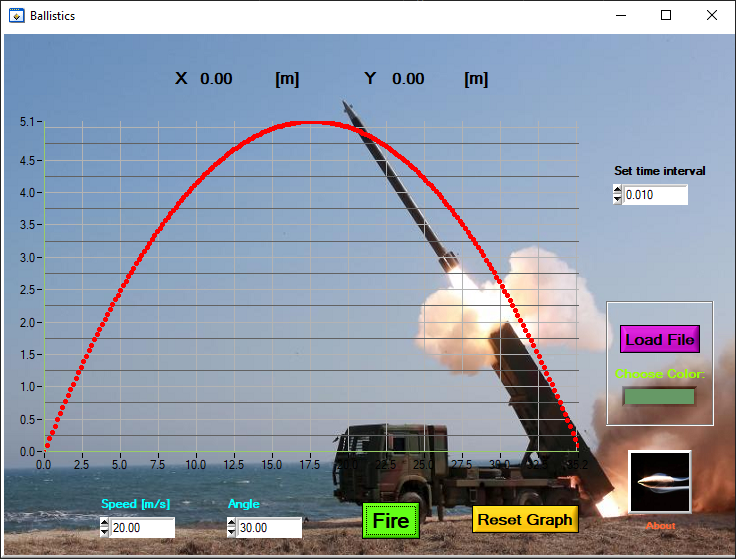

# Ballistics
Ballistics graphical simulation with respect to Speed, Angle of fire and a given time interval.

Created for practice as part of my "Embedded systems" course during 3rd year of my BSc studies.

